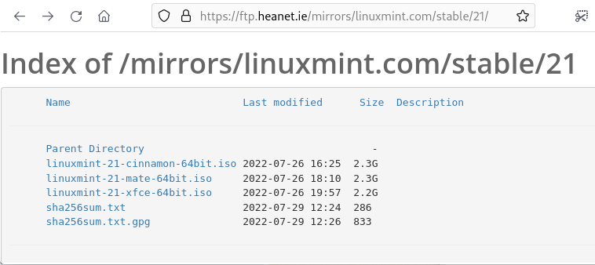
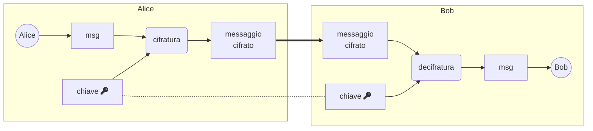
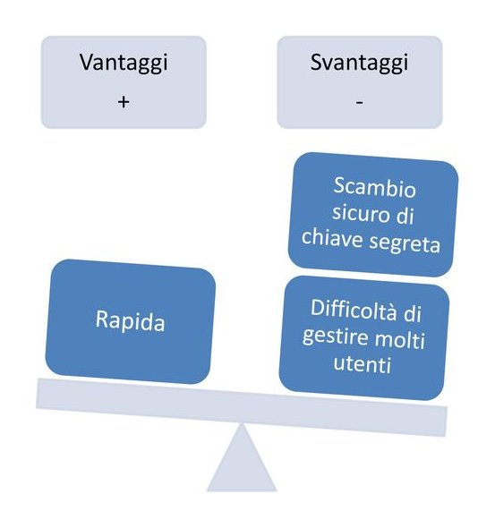
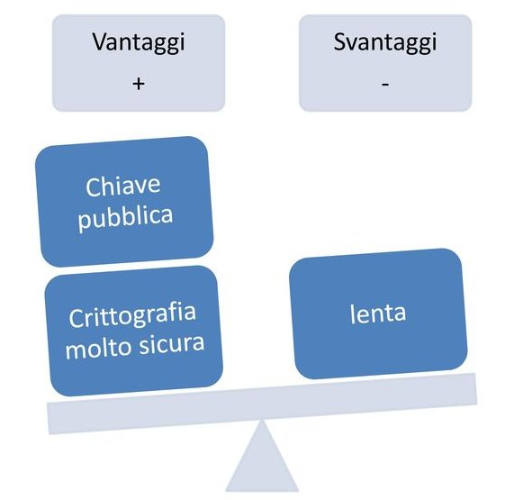
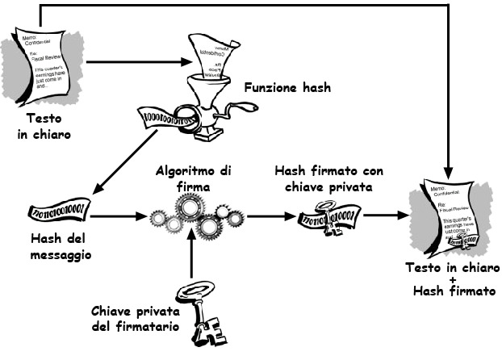
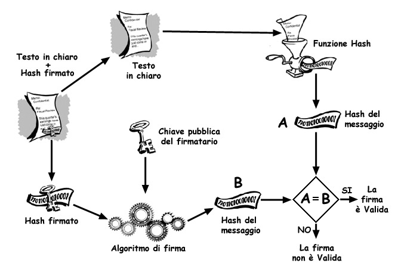
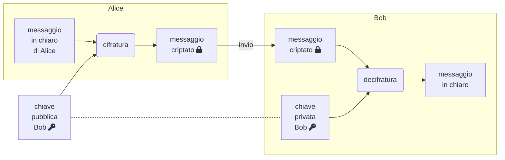
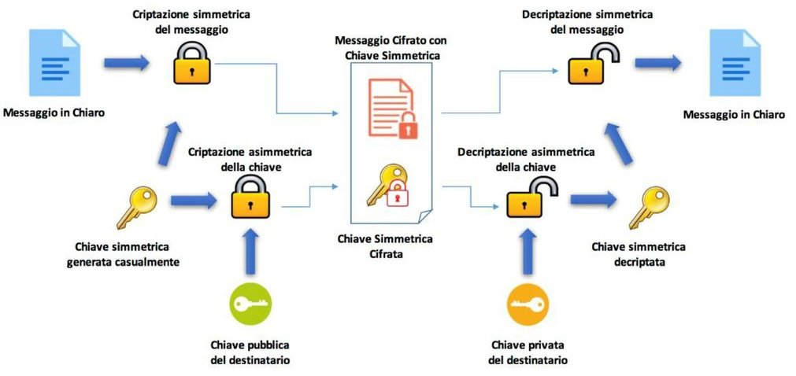
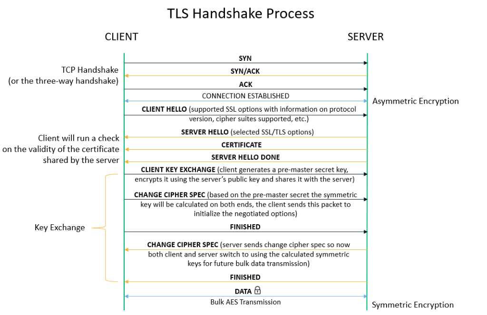

## Un amore crittografico


_Danilo Abbasciano_

Note:
breve descrizione tecnica:
Avvincente storia di Alice che grazie ai mezzi della crittografia
riesce a sabotare un matrimonio e dichiarare a tutti il suo amore
verso Bob.

Crittografia simmetrica/asimmetrica, firma elettronica, certificati
digitali e http+tls

---
### Agenda
 - crittografia
 - funzioni hash
 - crittografia simmetrica
 - salt
 - crittografia asimmetrica
 - firma elettronica
 - PGP
 - GnuPG
 - certificati digitali e CA
 - crittografia ibrida
 - http + TLS = https

Note:

---
### cosa è la crittografia
La crittografia è la base della protezione dei dati ed il modo più
importante per garantire che le informazioni non possano essere rubate
e lette.

----
### crittografia moderna

#### principio di Kerckhoffs
la sicurezza di un crittosistema non dipende dal tenere segreto
l'algoritmo crittografico, ma solo dal tenere segreta la chiave

#### massima di Shannon
un sistema dovrebbe essere progettato sotto l'assunzione che il nemico
acquisirà immediatamente familiarità con esso

----
### cosa può garantire la crittografia?

- **Riservatezza**: Può leggerlo solo il destinatario
- **Integrità**: Il messaggio non è stato alterato
- **Autenticità**: Il destinatario può verificare l'identità del mittente
- **Non ripudio**: L'autore del messaggio non potrà negare di averlo inviato

---
### funzioni hash

una funzione prende in ingresso (input) dei parametri e restituisce un
risultato (output)

Possiamo paragonarle alle funzioni matematiche che tutti conosciamo +,
-, /, ...

In particolare la funzione **hash** prende un solo parametro in
ingresso (come ad esempio la √)

---
### proprietà funzione hash
 - **unidirezionale**: Non esiste la funziona inversa

----
### proprietà funzione hash
 - unidirezionale
 - **univoca**: identifica univocamente un messaggio
 
Note:
   `$$ J(\theta_0,\theta_1) = \sum_{i=0} $$`
   
----
### proprietà funzione hash
 - unidirezionale
 - univoca
 - **deterministica**: Stesso messaggio stesso valore di hash
----
### proprietà funzione hash
 - unidirezionale
 - univoca
 - deterministica
 - **lunghezza fissa dell'output** indipendente dalla lunghezza del messaggio in ingresso
----
### proprietà funzione hash
 - unidirezionale
 - univoca
 - deterministica
 - lunghezza fissa dell'output
 - **resistenza alla collisione** difficoltà nel creare due messaggi
 distinti con lo stesso hash
----
### proprietà funzione hash
 - unidirezionale
 - univoca
 - deterministica
 - lunghezza fissa dell'output
 - resistenza alla collisione
 - **veloce** da calcolare
----
### proprietà funzione hash
 - **unidirezionale**: Non esiste la funziona inversa
 - **univoca**: identifica univocamente un messaggio
 - **deterministica**: Stesso messaggio stesso valore di hash
 - **lunghezza fissa dell'output** indipendente dalla lunghezza del
   messaggio in ingresso
 - **resistenza alla collisione** difficoltà nel creare due messaggi
   distinti con lo stesso hash
 - **veloce** da calcolare

---
### funzioni hash più comuni

| algoritmo | dimensione output (Byte) | sicura |
| ----      |  --- | -- |
| SHA-1     | 20   | NO |
| MD5       | 16   | NO |
| SHA256    | 32   | SI |
| SHA512    | 64   | SI |

---
#### applicazioni funzione hash
Verifica dell'integrità di un messaggio/file



```
f524114e4a10fb04ec428af5e8faf7998b18271ea72fbb4b63efe0338957c0f3 *linuxmint-21-cinnamon-64bit.iso
02a80ca98f82838e14bb02753bd73ee0da996c9cda3f027ae1c0ffb4612c8133 *linuxmint-21-mate-64bit.iso
3ad001dc15cb661c6652ce1d20ecdc85a939fa0b4b9325af5d0c65379cc3b17e *linuxmint-21-xfce-64bit.iso
```

----
#### applicazioni funzione hash
Verifica delle password

/etc/shadow
```
root:$y$j9T$bnWq/75L7bHk0xedMO1wc.$Ob6dLjepy.YFJz7rXyJHqbuyCCvuKsmnHU3zyamv.H6:18950:0:99999:7:::
test:$y$j9T$T..Bgz0qQNR.LBX3jwUzd0$Avt8FhdlV6x2PWNQxC910.mcNkloKJFHgJm5em0z3BC:19011:0:99999:7:::
```

Database
```
+------+------------------------------------------------------------------+
| NAME | PASSWORD                                                         |
+------+------------------------------------------------------------------+
| io   | 1ec2786727851647508085f26c5bff07159b8db7a8569be847afc58fa6b3878b |
+------+------------------------------------------------------------------+
```
----
#### applicazioni funzione hash
Identificare file o dati

---
#### crittografia simmetrica (o chiave privata)
la chiave di cifratura è uguale alla chiave di decifratura

---
#### crittografia simmetrica (o chiave privata)



----
### Alice **→** Bob
#### chiave simmetrica

Note:
I nomi Alice e Bob sono molto usati per convenienza nella crittografia

"La persona A vuole mandare un messaggio alla persona B"

difficile da seguire specialmente in sistemi complessi che usano molti
passaggi.
----
# ?
Note:

 - [X] *Riservatezza*: Può leggerlo solo il destinatario (Bob)
 - [X] *Integrità*: Il messaggio non è stato alterato
 - [X] *Autenticità*: Il destinatario Bob può verificare l'identità del mittente (Alice)
 - [ ] *Non ripudio*: L'autore di una dichiarazione non potrà negare la paternità e la validità del messaggio

----
### Rainbow table
una tabella precalcolata per memorizzare gli output di una funzione
hash, in genere per decifrare gli hash delle password.

Un malintenzionato può utilizzare le rainbow table precalcolate per
recuperare le password in chiaro.

Note:
https://crackstation.net/

----
### crittografia simmetrica con salt

Una difesa comune contro questo attacco consiste nel calcolare gli
hash utilizzando l'aggiunta di un "salt" alla password prima di
eseguirne l'hashing.

----
### Bob **→** Alice
#### chiave simmetrica con salt

---
### crittografia asimmetrica
#### (chiave pubblica e privata)

Ogni attore coinvolto ha una coppia di chiavi:
 - **chiave pubblica**: deve essere distribuita
 - **chiave privata**:  appunto personale, segreta

Note:
 - 512 bit -> poche ore
 - 1024 bit -> 1 anno con un milione di dollari
 - 2048 bit -> milioni di anni

----
#### crittografia asimmetrica



----
#### crittografia asimmetrica - firma elettronica



----
### Alice **→** Bob
#### chiave assimmetrica (firma elettronica)

----
# ?
Note:

 - [ ] *Riservatezza*: Può leggerlo solo il destinatario (Bob)
 - [X] *Integrità*: Il messaggio non è stato alterato
 - [X] *Autenticità*: Il destinatario Bob può verificare l'identità del mittente (Alice)
 - [X] *Non ripudio*: L'autore di una dichiarazione non potrà negare la paternità e la validità del messaggio

----
#### crittografia asimmetrica - verifica firma elettronica



----
### Bob
#### chiave assimmetrica (verifica firma elettronica)

---
#### crittografia asimmetrica


----
### Bob **→** Alice
#### demo crittografia asimmetrica (openssl)

----
# ?
Note:

 - [X] *Riservatezza*: Può leggerlo solo il destinatario (Bob)
 - [X] *Integrità*: Il messaggio non è stato alterato
 - [ ] *Autenticità*: Il destinatario Bob può verificare l'identità del mittente (Alice)
 - [ ] *Non ripudio*: L'autore di una dichiarazione non potrà negare la paternità e la validità del messaggio

---
### PGP (Pretty Good Privacy)

Uno dei software che è divenuto molto famoso nell'ultimo decennio è il
PGP (Pretty Good Privacy), sviluppato da *Phil Zimmermann* nel 1991.

Usato per la posta elettronica e la protezione dei file di uso
personale che consente di firmare una e-mail lasciando il testo in
chiaro, oppure cifrarla senza firmarla, o fare entrambe le cose.

Note:
governo statunitense visto che i sistemi di cifratura forte sono
assimilati alle armi e fino ad alcuni anni fa ne era quindi proibita
l'esportazione.

Copie di PGP vennero scaricate all'estero poche ore dopo la messa
on-line del programma;

Nel 1993 Zimmerman venne messo sotto inchiesta, con la prospettiva di
pesanti sanzioni penali. Dopo tre anni la vicenda si concluse senza
esiti negativi per la propria persona.

----
### GnuPG (GNU Privacy Guard)

GnuPG è un sistema crittografico che permette la cifratura/decifratura
e autenticazione di messaggi. La cifratura/decifratura si basa su un
sistema "ibrido" simile a quello usato da PGP con l'utilizzo combinato
di algoritmi simmetrici e asimmetrici, ma non preclude la possibilità
di cifrare/decifrare anche solo con algoritmi simmetrici.

Note:
https://www.gnupg.org/gph/it/gestione-chiavi.html

----
### Alice **→** Bob
#### GPG: cifratura e firma digitale

----
# ?
Note:

 - [X] *Riservatezza*: Può leggerlo solo il destinatario (Bob)
 - [X] *Integrità*: Il messaggio non è stato alterato
 - [X] *Autenticità*: Il destinatario Bob può verificare l'identità del mittente (Alice)
 - [X] *Non ripudio*: L'autore di una dichiarazione non potrà negare la paternità e la validità del messaggio

---
### Bob **→** Alice
#### GPG e thunderbird

---
### certificati digitali

#### Certificato digitale è documento che contiene:
 - la chiave pubblica
 - dati del propretario
 - firma digitale che ne garantisce la validità da parte di una CA (Certification Authority)
----
### certificati digitali e CA (Certification Authority)

#### Certification Autority è un ente di certificazione:
  - ha una coppia di chiavi che usa per validare i certificati
  - registro pubblico dei certificati digitali emessi e tuttora validi

Note:
less /etc/pki/tls/cert.pem

----
#### generazione certificato digitale

 <!-- .element width="800px" -->

----
### Alice
#### generazione certificato digitale

---
### crittografia ibrida



Note:

riassume le caratteristiche dei due tipi di crittografia. Infatti
viene usato sia un algoritmo a chiave simmetrica sia uno a chiave
asimmetrica.

Ogni utente ha una coppia di chiavi privata e pubblica. Ogni volta che
il mittente apre una nuova sessione viene generata una chiave di
sessione, la quale viene cifrata con la chiave pubblica del
destinatario e inviata insieme al messaggio. Il destinatario, per
prima cosa decifra la chiave di sessione usando la propria chiave
privata asimmetrica, poi usa la chiave di sessione, simmetrica, per
decodificare il messaggio.

Il vantaggio di questo sistema è che unisce la comodità nella gestione
delle chiavi del sistema asimmetrico alla velocità propria di quello
simmetrico e consente uno scambio di chiavi sicuro anche su un canale
non sicuro.

---
#### comunicazioni sicure su Internet: https



Note:
https://sectigostore.com/page/how-does-https-work/
 1. client hello con le versioni supportate e il server risponde con
    le sue, server hello!
 2. verifica certificato SSL/TLS
    il server invia il suo certificato pubblico, il client verifica
    che sia valido, non revocato, e si assicura che supporti le
    cifrature richieste. Conferma che il certificato appartiene al
    nome di dominio/ip.
 3. convalida della firma CA
    verifica che il certificato sia firmato da una CA leggittima.
 4. il browser genera una chiave di sessione casuale e lo crittogra
    con la chiave pubblica nel certificato del server.
	Il server decripta la chiave di sessione con la chiave privata.
 5. tutti i dati trasmessi viaggiano su un canale sicuro e
    crittografato con la chiave di sessione

---

## ... e vissero per sempre felici e criptati

_danilo@piumalab.org_

https://github.com/piuma/talk-amore-crittografico


